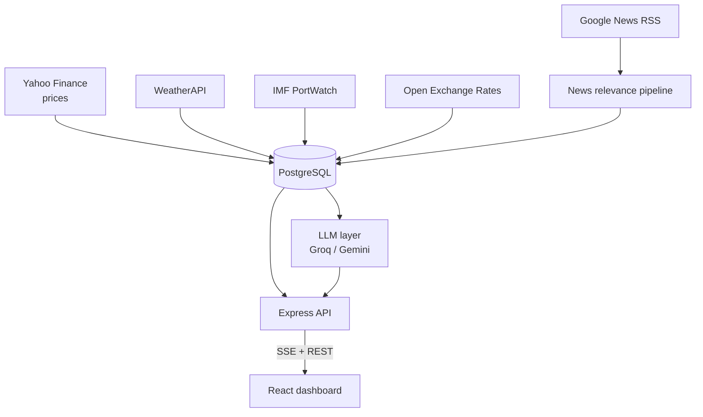

# FOps Pulse

**Market-intelligence platform for food supply chains.** It watches commodity prices, news, weather, port activity and currency rates, decides which of it actually matters to a given planner, and turns that into a short ranked list of alerts and AI-generated recommendations.

The core problem it solves: a supply planner shouldn't find out about a wheat export ban three days late, and shouldn't have to read 400 irrelevant articles to find the one that matters.

> Built as a solo project. Node.js + Express, React, PostgreSQL, deployed on Render via Docker.

<!-- Add a screenshot here — it is the single highest-value addition to this README:
      -->

---

## What it does

- **Tracks live prices** for user-selected commodities (futures via Yahoo Finance), streamed to the dashboard over Server-Sent Events.
- **Filters news per user** through a multi-stage relevance pipeline, so each account sees only what touches its commodities and regions.
- **Raises alerts** on unusual price moves and genuine supply-chain disruptions, with a 24-hour freshness rule in both directions.
- **Explains itself** — every article the pipeline accepted or rejected is logged with the deciding stage and the reason.
- **Generates recommendations** with an LLM, grounded strictly in the data the deterministic layer selected.
- **Adds context** the planner would otherwise chase manually: GCC port throughput anomalies (IMF PortWatch), FX spot rates, and regional weather.

## Architecture



One Node process serves both the REST/SSE API and the built React app. All state lives in PostgreSQL, so the free-tier host can restart at any time without losing alerts, audit history, or scan results.

## The news pipeline

The part that carries the product. Each article passes through ordered stages, and **any rejection is recorded with its reason**:

| Stage | What it does |
|---|---|
| Normalize | Unwrap Google redirect URLs, extract publish date, dedupe |
| Profile builder | Expand the user's commodities and regions into search terms and aliases |
| Rule engine | Keyword and entity gating, with blocklists for known noise contexts |
| Region matcher | Match against region aliases, including micro-regions |
| Relevance scorer | Score business relevance and disruption severity |
| Semantic filter | `all-MiniLM-L6-v2` sentence embeddings, cosine similarity against per-user seed examples |
| Priority classifier | Assign Critical / High / Medium / Low |

**Embeddings run in-process** (`@xenova/transformers`) rather than through a paid API — the pipeline embeds every article on every scan, so a per-call cost would dominate the budget.

## Tech stack

| Layer | Choice |
|---|---|
| Backend | Node.js 22, Express 5 |
| Database | PostgreSQL (`pg`), 26 ordered idempotent migrations |
| Frontend | React 19, Vite, Recharts |
| Live data | Server-Sent Events |
| ML / NLP | `@xenova/transformers` (MiniLM), `compromise`, `sentiment`, `simple-statistics` |
| LLM | Groq (`openai/gpt-oss-120b` reasoning, `openai/gpt-oss-20b` summaries), Google Gemini for chat + embeddings |
| Auth | `express-session` + `connect-pg-simple`, bcrypt |
| Deploy | Docker (`node:22-slim`) on Render, auto-deploy from `main` |
| CI | GitHub Actions — syntax checks, unit tests, dashboard build |

## Engineering notes

A few decisions that shaped the codebase:

- **No fabricated output.** If a data source or the LLM fails, the UI shows an explicit error rather than canned or degraded text. In a procurement tool, a confident wrong answer is worse than a visible failure. A smoke test fails the build if any fallback-marker text appears in a response.
- **Deterministic layer picks, LLM explains.** The LLM never chooses which data is relevant and never invents figures — it summarizes what the pipeline already selected.
- **Migrations are replay-safe.** Every migration runs on every boot, so they must all be `IF NOT EXISTS`. The container's start command is `node migrate.js && node server.js`.
- **Provider limits are expected, not exceptional.** LLM calls sit behind per-key circuit breakers that honour the provider's stated cooldown.
- **State survives restarts.** The host spins down when idle, so alerts, audit logs, sessions and last-scan results are all persisted rather than held in memory.

## Running locally

Requires Node 22+ and a PostgreSQL instance.

```bash
git clone https://github.com/Shashwatm7/fops-pulse.git
cd fops-pulse
npm install
cd dashboard && npm install && cd ..

cp .env.example .env    # then fill in the values below
node migrate.js         # create the schema
node server.js          # API on :3001
```

For frontend hot-reload, run the dashboard separately (it proxies `/api` to port 3001):

```bash
cd dashboard && npm run dev
```

### Environment variables

| Variable | Purpose |
|---|---|
| `DATABASE_URL` | PostgreSQL connection string |
| `SESSION_SECRET` | Session signing secret (**required in production**) |
| `GROQ_API_KEY` | Groq key, or a comma-separated pool (rotates on rate limits only) |
| `GROQ_MODEL_REASONING` | Override the planner/deep-dive model (default `openai/gpt-oss-120b`) |
| `LABELING_GROQ_MODEL` | Override the summary model (default `openai/gpt-oss-20b`) |
| `LLM_TIMEOUT_MS` | Per-call LLM timeout, default 45000 |
| `GEMINI_API_KEY` | Gemini, used for embeddings |
| `WEATHER_API_KEY` | WeatherAPI |
| `OPEN_EXCHANGE_APP_ID` | Open Exchange Rates |

The first account created on an empty database is granted admin automatically.

## Tests

```bash
npm test    # node:test unit suites over the pure logic modules
```

Providers decommission models with little notice, and a 404 takes the feature
down until config changes. Before deploying, verify every configured model
still exists on your key and still honours JSON mode:

```bash
npm run check:models
```

`GET /api/health/ai` reports the same thing at runtime, returning **503** when a
provider is hard-down (model decommissioned or key rejected) rather than only
counting successes. Point an uptime check at it.

CI additionally runs syntax checks on every entrypoint and a full production build of the dashboard, so a broken build cannot reach `main`.

## Project structure

```
server.js                  API routes, price engine, scanner scheduling
db.js                      All database access
auth.js                    Auth, onboarding, admin routes
migrate.js                 Ordered, idempotent migration runner
services/
  news-pipeline/           Staged relevance pipeline
  ingestion/               Price, weather, port and news collectors
  planner/                 LLM recommendation generation
dashboard/                 React + Vite frontend
migrations/                Numbered SQL migrations
tests/                     Unit tests
```

## Status

Actively developed. Known limitations: single-instance only (circuit-breaker and cache state is in-memory), and price/news feeds use unofficial endpoints that would need licensed replacements for commercial use.
