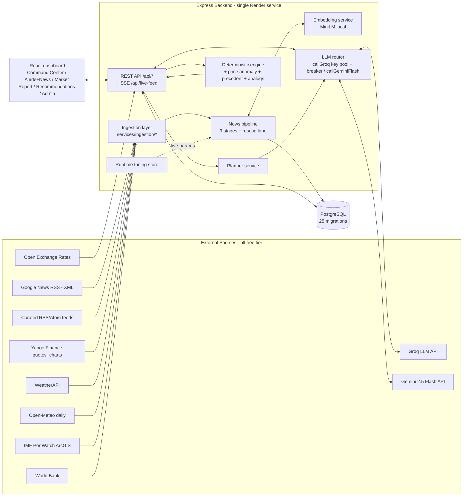

# 4. Solution Architecture

## 4.1 Stack (as built)

| Layer | Technology |
|---|---|
| Frontend | React 18 + Vite, Recharts, lucide-react; served as static `dist/` by the backend |
| Backend | **Node.js + Express 5** (single service, `server.js` + `services/*` modules) |
| Database | PostgreSQL (Render managed; local Postgres for dev) |
| AI — generation | Groq `llama-3.3-70b-versatile` (planner, deep-dive, summaries); Gemini 2.5 Flash (market indicators, precedent classifier) |
| AI — embeddings | Local MiniLM `Xenova/all-MiniLM-L6-v2` via `@xenova/transformers` (384-dim, zero API cost) |
| NLP utilities | `compromise` (entities), `sentiment`, `cheerio` (extraction), `rss-parser` |
| Sessions | `express-session` + `connect-pg-simple` (PgStore) |
| Email | `nodemailer` |
| Hosting | Render web service (free tier), auto-deploy from `main` |

> **ℹ️ Note** — There is no FastAPI, Docker, or Ollama in this system. REST APIs are Express routes under `/api/*`.

## 4.2 Component Diagram

## 4.3 Component Responsibilities

| Component | Responsibility | Key files |
|---|---|---|
| Ingestion layer | Fetch + normalize external data; per-item upsert; failure isolation | `services/ingestion/{news_rss,curated_feeds,weather,market,port_activity}.js`, inline fetchers in `server.js` |
| News pipeline | Per-user relevance decision for every article; audit every decision | `services/news-pipeline/pipeline.js`, `stages/1..8`, `entity_matcher.js`, `categorizer.js` |
| Embedding service | Local MiniLM embeddings; seed-vector + noise-centroid caches | `services/labeling/embeddingService.js`, stage 6 |
| LLM router | Task→key pinning, per-key circuit breaker, pool rotation on 429, token accounting, **no fallback** | `callGroq` / `callGeminiFlash` in `server.js` |
| Deterministic engine | Alert quota/sort, market snapshot assembly, drivers prompt data | `services/deterministic-engine.js`, `services/alert-relevance.js`, `services/price-anomaly.js`, `services/precedent-engine.js`, `services/price-analogs.js` |
| Planner | Context bundle (headlines-only) + strict-format prompt → 4 recommendations | `services/planner/plannerService.js` |
| Runtime tuning | Admin-editable live params: `semanticThreshold`, `rocchioGamma` (currently 0 = Rocchio off), `extraSeeds`, `noiseSeeds`, `llmTemperature` | `services/tuning.js` |
| REST API + SSE | ~40 authed routes; 5-s SSE price broadcast | `server.js`, `auth.js` |
| Frontend | Tabs: Command Center (`pulse`), Alerts+News (`alerts`), Market Report (`marketinfo`), Recommendations (`actions`); Settings, Admin, Pipeline Analytics pages | `dashboard/src/*.jsx` |

## 4.4 External Integration Points (FOps connect surface)

| System | Direction | Protocol | Cadence |
|---|---|---|---|
| Google News RSS | in | HTTPS XML | per scan (interval + manual) |
| Curated feeds (`RSS_FEEDS` env) | in | HTTPS RSS/Atom | per scan |
| Yahoo Finance | in | HTTPS JSON (unofficial) | 15-min tick + on-demand charts |
| WeatherAPI | in | HTTPS JSON | per dashboard request |
| Open-Meteo | in | HTTPS JSON | manual script (`raw_weather`) |
| Open Exchange Rates | in | HTTPS JSON (app_id) | per request; hourly upstream |
| IMF PortWatch | in | ArcGIS FeatureServer JSON | boot + weekly |
| World Bank | in | HTTPS JSON | manual (`raw_market_data`) |
| Groq / Gemini | out+in | HTTPS JSON | per AI request |
| SMTP (nodemailer) | out | SMTP | on new HIGH/CRITICAL alert |
| **Future:** ERP/MES/WMS | — | API/ETL | not yet built (page 16) |
