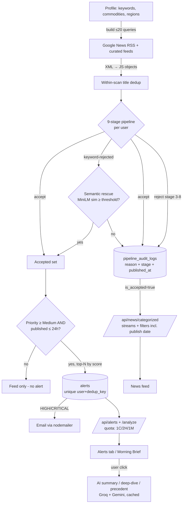

# 5. Data Flow — Lifecycle of a News Article

## 5.1 Narrative

1. **Fetch.** The user scanner builds up to 20 search queries from the user's profile (keywords + commodities + regions, region-pinned) and pulls Google News RSS (XML) plus curated feeds. XML is parsed to plain JS objects immediately: `{ title, description, url, publishedAt, source }`. Nothing is stored as XML.
2. **Within-scan dedup.** Same-story syndication collapsed by normalized title key.
3. **Pipeline decision (per user).** The article runs stages 1→8 (page 6). Every outcome — accept or reject, with stage and reason — is written to `pipeline_audit_logs` (including `published_at`, migration 024).
4. **Rescue lane.** Keyword-rejected articles that are semantically unmistakable (MiniLM similarity ≥ rescue threshold) are re-accepted with a rescue score.
5. **Ranking + freshness gate.** Accepted articles with priority ≥ Medium are sorted by relevance; articles **published > 24 h ago are not alerted**. Top-N become alerts.
6. **Alert persistence.** `INSERT` into `alerts` with `dedup_key = profile:<titleKey>` (unique per user — the durable dedup guard). Payload carries source, description, `semanticSimilarity`, `publishedAt`. New CRITICAL/HIGH alerts trigger email.
7. **Serving.** `getActiveAlerts` lazily expires rows > 24 h old, hides pre-profile-change rows (`settings_changed_at`) and stale-published news alerts; the severity quota (1 CRITICAL / 2 HIGH / 1 MEDIUM) shapes the Alerts tab, `/api/alerts`, and Morning Brief identically.
8. **Categorized feed.** Accepted articles from the audit log are entity-matched, categorized, split into risk/commodity streams, and served by `/api/news/categorized` with `publishedAt` for the date filter.
9. **On-demand AI.** From an alert the user can request an AI summary (Groq, cached in `article_summary_cache`), a deep-dive, or a precedent lookup ("last time this happened").

## 5.2 Flowchart

## 5.3 Freshness & Consistency Rules

| Rule | Mechanism |
|---|---|
| No alerts on stale stories | Publish-date gate (> 24 h ⇒ no alert) at creation **and** at read time |
| No zombie alerts | `status='expired'` when `created_at` > 24 h (lazy, on read) |
| No stale-profile alerts | `created_at >= settings_changed_at` filter |
| No duplicate alerts across scans/restarts | DB unique index `(user_id, dedup_key)` |
| Same numbers everywhere | Alerts tab, `/api/alerts`, Morning Brief share the same fetch + sort + quota; price change is vs previous close on all surfaces |
| Re-evaluate on profile change | Rejection memo keyed by profile fingerprint (includes `custom_regions`) |
