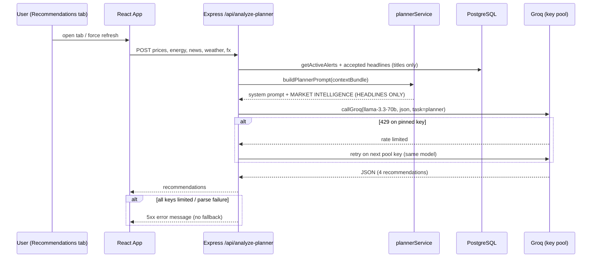
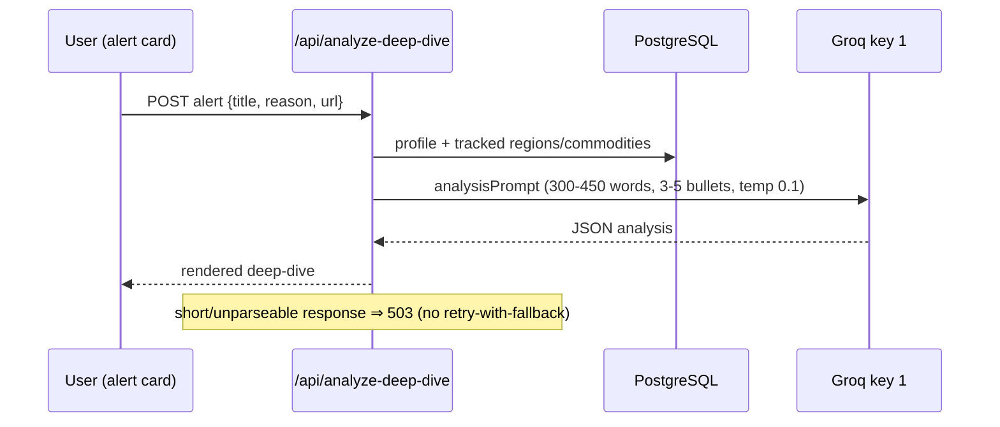

# 6. AI Pipeline

## 6.1 Relevance Pipeline (stages)

| Stage | Name | What it does | Reject reason examples |
|---|---|---|---|
| 1 | Normalize | Trim/decode fields; carry `publishedAt` through | — |
| 2 | Profile builder | Builds the watchlist profile: expanded query seeds (`mlSeeds`, incl. customer graft), per-profile semantic threshold | — |
| 3 | Rule checks | Blocklist / excluded-context kills | "Matched excluded context" |
| 4 | Region gate | Article must touch a tracked region (canonicalized) unless commodity-matched | "No tracked region" |
| 5 | Relevance scoring | Keyword/commodity/business scoring → 0–100 | "Score too low (n)" |
| 6 | Semantic filter | MiniLM max-cosine of article vs profile seeds vs threshold (see 6.3) | "Semantic similarity x < threshold" |
| 7 | Dedup / memo | Rejection memo keyed by profile fingerprint; already-alerted set | "Previously rejected (unchanged profile)" |
| 8 | Priority classifier | Score → Critical/High/Medium/Low/Ignored | "Priority Ignored" |
| 9 | Emission | Audit log + alert insert + email | — |

**Rescue lane:** an article rejected at stages 3–5 can still be accepted if MiniLM similarity to the profile seeds is unmistakably high — score is derived from similarity (60–84), reason recorded as "Semantic rescue".

## 6.2 Entity Extraction & Event Categorization

- **Entity matcher** (`entity_matcher.js`): master-data match of commodities, regions, chokepoints, ports, routes, suppliers → typed chips on news cards (`REGION_CATALOG` powers the region filter).
- **Categorizer** (`categorizer.js`): assigns one business category per article (e.g. Supply Chain Disruption, Trade Policy, Prices) with `isDisruption` flag; combined with entity streams to produce `risk` / `commodity` / `other`.
- **Local extraction** (`compromise` + sentiment): entities and extractive "NLP Summary" sentences without any LLM call.

## 6.3 Semantic Filter & Rocchio (current state)

- Embeddings: `Xenova/all-MiniLM-L6-v2`, 384-dim, L2-normalized; cosine = dot product. Seed vectors cached by content hash; article embedded once (title + description, ≤ 500 chars).
- **Decision score:** `maxCosine(article, positiveSeeds)`; accept if ≥ effective threshold.
  - Effective threshold precedence: admin-touched tuning value → per-profile calibration → tuning default → 0.30.
- **Rocchio noise term is currently DISABLED** (`rocchioGamma = 0` by default). When γ > 0 the gate instead uses `maxPos − γ · cosine(article, noiseCentroid)`. Re-enable via env `ROCCHIO_GAMMA` or the admin slider (prior default 0.5). The raw similarity is always recorded and shown as the ⛭% badge regardless.
- Failure policy: gate **fails open** (embedding error ⇒ pass), rescue **fails closed**.

## 6.4 LLM Task Routing

| Task | Model | Key pinning | Output |
|---|---|---|---|
| Planner | Groq `llama-3.3-70b-versatile` | key 0 | JSON, exactly 4 recommendations (2×90D, 2×365D), max_tokens 3000 |
| Deep-dive | Groq 70B | key 1 | JSON, 300–450 words, 3–5 bullets, max_tokens 3000 |
| Article summary | Groq 70B | key 2 (`LABELING_GROQ_KEY_INDEX`) | Cached in `article_summary_cache` |
| Market indicators | Gemini 2.5 Flash | — | JSON, 3 drivers {factor, direction, strength, evidence}, 1 h cache |
| Precedent classifier | Gemini 2.5 Flash | — | Event normalization/matching |

- `GROQ_API_KEY` = comma-separated key pool. Preferred key per task; **on 429 the per-key breaker opens for the provider-stated cooldown and the call rotates to the next closed-breaker key (same model)**. Only when all keys are limited does the error propagate.
- Temperature: `tuning.llmTemperature` (0.1). Token usage tracked per call (`[TOKENS]` logs).

> **⚠️ No-fallback policy** — On any generation failure the route returns an error; the UI renders an error banner. No smaller model, no canned text, no stale cache substitution.

## 6.5 Sequence — Planner Request

## 6.6 Sequence — Alert Deep-Dive

## 6.7 Forecast / Analytics Components (as built)

| Component | Method | Output |
|---|---|---|
| Price anomaly detector (`price-anomaly.js`) | Robust σ (MAD) on daily returns; z ≥ 2.5 and move ≥ 1.5%; 90-day range breaks; vol-regime shift (σ7/σ90 ≥ 2); futures roll-guards | PRICE alerts with planner-readable wording ("5× its typical daily move") |
| Precedent engine | Normalize event → match historical events → compute aftermath | "Last time this happened" panel |
| Price analogs | Similar historical price patterns | Analog summaries in analysis |
| ML forecasts (`/api/ml-forecasts`, mig. 006) | Stored forecast outputs surfaced to dashboard | Forecast panel |
| Planner horizons | LLM recommendations constrained to 2 × 90-day + 2 × 365-day | Recommendations tab |

> **ℹ️** There is no separate 7/30/90-day statistical forecast engine; horizon guidance is produced by the planner (90/365-day) plus the anomaly/precedent analytics above.
