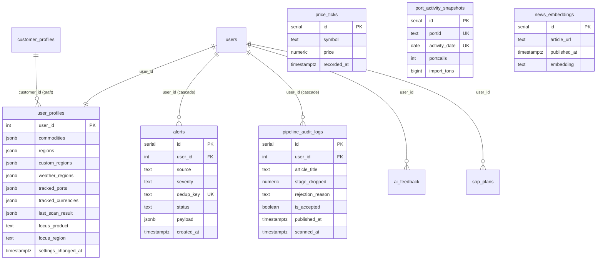

# 7. Database Design

PostgreSQL; schema managed by **append-only, idempotent migrations** (`migrations/001…025`, executed on every boot by `migrate.js`; one failure does not block the rest). All user-linked tables use `ON DELETE CASCADE`.

## 7.1 Core Tables

| Table | Grain | Key columns | Purpose / cadence |
|---|---|---|---|
| `users` | 1 row / user | `id` PK, `email` (unique), `password_hash` (bcrypt), `is_admin`, `is_onboarded`, `company_name`, `created_at` | Identity + role |
| `user_profiles` | 1 row / user | `user_id` PK/FK; JSONB: `commodities`, `regions`, `custom_regions`, `news_keywords`, `custom_blocklist`, `price_alerts`, `weather_regions` (021), `tracked_ports` (022), `tracked_currencies` (023, default 6), `last_scan_result` (025); `focus_product`, `focus_region`, `template_name`, `customer_id`, `settings_changed_at` (017), `last_scan_at` | Personalization hub |
| `session` | 1 row / session | `sid` PK, `sess` JSON, `expire` | connect-pg-simple store |
| `alerts` (010) | 1 row / alert / user | `id` PK, `user_id` FK, `source` (GEO\|PROFILE_NEWS\|PRICE), `category`, `severity`, `title`, `reason`, `url`, `relevance_score`, `payload` JSONB (incl. `semanticSimilarity`, `publishedAt`), `dedup_key`, `status` (active\|acknowledged\|expired), `created_at` | **Unique `(user_id, dedup_key)`** = durable dedup; 24 h lazy expiry |
| `pipeline_audit_logs` (008/009/024) | 1 row / article / user / scan | `id` PK, `user_id` FK, `article_title`, `article_url`, `source`, `stage_dropped`, `rejection_reason`, `relevance_score`, `is_accepted`, `extracted_features` JSONB, `published_at` (024), `scanned_at` | Explainability + categorized feed source |
| `price_ticks` (001) | 1 row / symbol / tick | `symbol`, `price`, `change_pct`, `recorded_at` | 15-min Yahoo tick; BRIN on time |
| `weather_snapshots` (001) | 1 row / region / fetch | `region_name`, `lat`, `lon`, `temp_c`, `precip_mm`, `humidity`, `wind_kph`, `condition`, `recorded_at` | Written on each `/api/weather` |
| `port_activity_snapshots` (022) | 1 row / port / day | `portid`, `portname`, `country`, `iso3`, `activity_date`, `portcalls`, `portcalls_container`, `import_tons`, `export_tons`, `fetched_at`; **unique `(portid, activity_date)`** | IMF PortWatch cache; weekly |
| `news_embeddings` (011) | 1 row / article | `article_url`, `title`, `summary`, `source`, `published_at`, `embedding`, `region`, `commodity` | MiniLM vectors for similarity search |
| `article_summary_cache` (015/018/019) | 1 row / article | url/title key, summary, key figures, version | Avoids re-summarizing (SUMMARY_VERSION busts) |
| `customer_profiles` (012) | 1 row / customer | `id`, `news_keywords`, `regions`, `ml_seeds` (20 curated positive headlines for Aramtec), `custom_blocklist`, `signal_keywords` | Grafted onto member users at scan time |
| `ai_feedback` (002) | 1 row / rating | user, feature, context, response, is_helpful, notes | 👍/👎 loop |
| `sop_plans` | 1 row / plan | plan fields + status | S&OP plan store |
| `raw_news_articles` (004) | 1 row / RSS item | incl. `raw_json` JSONB, `published_at` NOT NULL | rss-parser lane |
| `raw_weather` (004) | 1 row / region / day | unique `(date, region)` | Open-Meteo ingester |
| `raw_market_data` (004) | 1 row / metric obs | unique `(date, source, metric_name, category, region)` | World Bank |
| Forecast/reco stores (005–007) | per output | canonical signals, forecast outputs, recommendations | `/api/ml-forecasts` etc. |

## 7.2 ER Diagram

## 7.3 Indexing Highlights

| Index | Table | Why |
|---|---|---|
| UNIQUE `(user_id, dedup_key)` | alerts | Cross-restart alert dedup (insert-first pattern) |
| `(user_id, status, created_at DESC)` | alerts | Active-alert reads |
| `(user_id, scanned_at DESC)` | pipeline_audit_logs | Analytics + categorized feed |
| `(user_id, published_at DESC)` (024) | pipeline_audit_logs | Publish-date filter |
| BRIN `recorded_at` + btree `symbol` | price_ticks | Time-series reads at low index cost |
| UNIQUE `(portid, activity_date)` | port_activity_snapshots | Weekly upsert idempotency |

## 7.4 Conventions & Notes

- **JSONB for per-user lists** (commodities, regions, ports, currencies): read-modify-write via dedicated setters (`setWeatherRegions`, `setTrackedPorts`, `setTrackedCurrencies`) so unrelated profile fields are never clobbered.
- **Self-healing inserts:** audit-log insert retries after `ALTER TABLE ... ADD COLUMN IF NOT EXISTS` on error 42703 (schema drift on old deployments).
- **Timestamps:** `created_at`/`scanned_at` = system time; `published_at` = article publish time. Alert freshness uses **both** (creation expiry + publish gate).
- Legacy: `better-sqlite3` dependencies remain from the pre-Postgres era (`migrate-sqlite-to-pg.js`); Postgres is the only live store.
