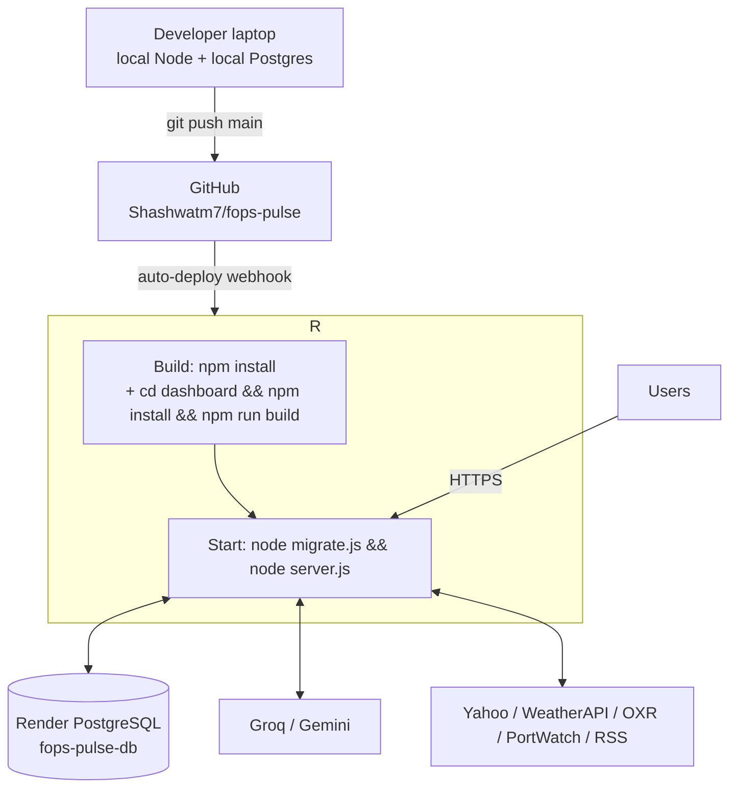

# 11. Deployment Architecture

> **ℹ️** No Docker, no Kubernetes, no separate CI system. Deployment is **Render-native**: push to `main` → Render builds → runs. This page documents that accurately.

## 11.1 Topology



## 11.2 Build & Start

| Phase | Command | Notes |
|---|---|---|
| Build | `npm install` + `npm run build` (`cd dashboard && npm install && npm run build`) | `dashboard/dist` is **gitignored** and rebuilt on every deploy |
| Start | `node migrate.js && node server.js` | Migrations are idempotent and re-run on **every boot**; one failing file logs and continues |
| Static serving | Express serves `dashboard/dist`; `index.html` sent `Cache-Control: no-cache`, hashed `/assets/` immutable | Prevents stale-chunk crashes after deploys |

## 11.3 Free-Tier Behavior (operationally important)

| Behavior | Impact | Mitigation |
|---|---|---|
| Spin-down when idle | First request after idle: 30–60 s cold start | Warm the URL before demos; paid tier removes this |
| Deploy queue lag | Push → live can lag several minutes | Check Render dashboard "Events" |
| Restart wipes memory | In-memory caches/breakers/scan state lost | Critical state persisted: alerts, audit logs, embeddings, `last_scan_result` (mig. 025) |
| No cron | Schedulers are boot-time `setInterval`s | Prices 15 min; PortWatch boot + weekly; scans gated by last-scan age |

## 11.4 Environment Variables

| Variable | Purpose |
|---|---|
| `DATABASE_URL` | Postgres connection (TLS for Render external) |
| `SESSION_SECRET` | **Must be set in prod** (code has a dev fallback constant) |
| `GROQ_API_KEY` | Comma-separated key pool; task pinning planner:0, deepdive:1, summary:2, drivers:3, precedent:4 (mod N) |
| `GEMINI_API_KEY` | Market indicators + precedent classifier |
| `WEATHER_API_KEY` | WeatherAPI (live weather + location search) |
| `OPEN_EXCHANGE_APP_ID` | Open Exchange Rates (FX panel; 503 without it) |
| `RSS_FEEDS` | Optional curated feed URLs (prevetted lane) |
| `ENABLE_USER_SCANNER`, `ENABLE_GEO_SCANNER`, `ENABLE_BACKGROUND_AI`, `ENABLE_AI_WORKER`, `ENABLE_AI_FORECASTER` | Feature switches (`'true'` to enable) |
| `USER_SCAN_INTERVAL_MS`, `GEO_SCAN_INTERVAL_MS`, `AI_WORKER_INTERVAL_MS` | Scheduler cadences |
| `ROCCHIO_GAMMA`, `SEMANTIC_THRESHOLD`, `LABELING_GROQ_KEY_INDEX` | Relevance/AI boot defaults (admin panel can override at runtime) |
| SMTP settings | nodemailer alert emails |

Local dev: `.env` at repo root (**`dotenv` loads with `override: true`** — .env beats inline shell vars; also loads `/etc/secrets/.env` on Render).

## 11.5 CI/CD

- **Pipeline:** GitHub `main` = production. No PR gate or test stage currently — a deliberate early-stage trade-off. Recommended next step: GitHub Action running `node --check`, `npm run build`, and the smoke script before merge.
- **Rollback:** `git revert` + push (Render redeploys), or Render "Rollback" to a previous deploy.
- **DB changes:** append a new numbered idempotent migration + register it in `migrate.js`. Never edit an applied migration.

## 11.6 Local Development

```bash
npm install && (cd dashboard && npm install)
# .env: DATABASE_URL=postgres://localhost/fops, GROQ_API_KEY=..., WEATHER_API_KEY=...
node migrate.js && node server.js     # backend :3001
cd dashboard && npm run dev            # Vite dev server, proxies /api
npm run smoke:endpoints                # AI endpoint smoke test
node scripts/make-admin.mjs you@x.com "<postgres url>"   # grant admin (works on Render DB)
```
